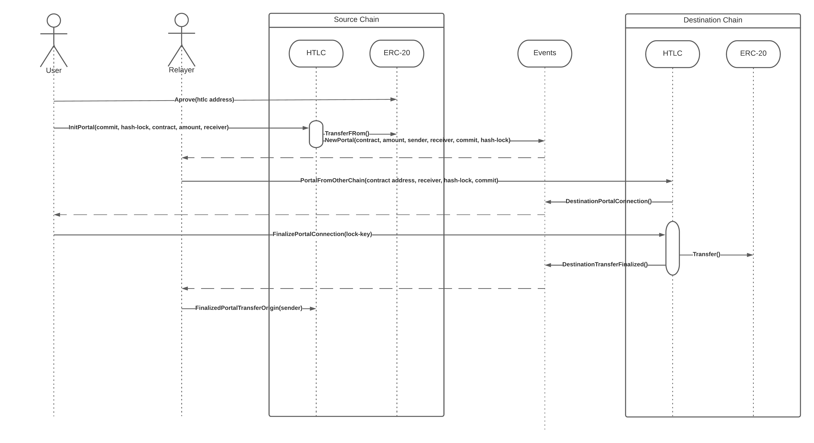

# HTLC Cross Bridge

Simple smart contract to transfer tokens accros multiple evm-compatible chains.

## ERC-20

## ERC-721

This section is still in progress. The easiest solution to transfer the asset would be to follow almost the same workflow as described in the previous diagram with the difference of minting the nft in the destination blockchain and copying the metadata URI into the new contract.
